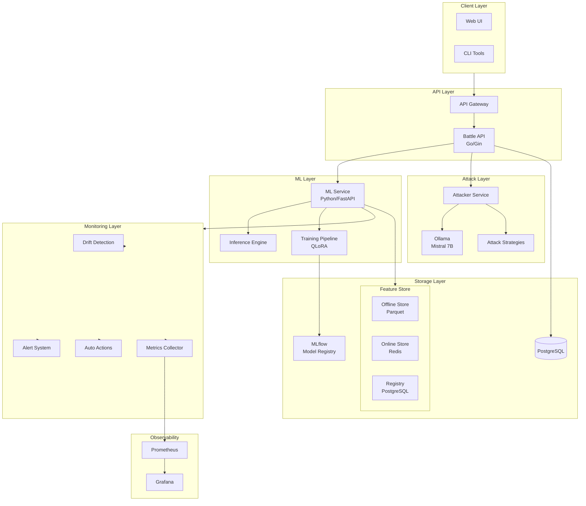
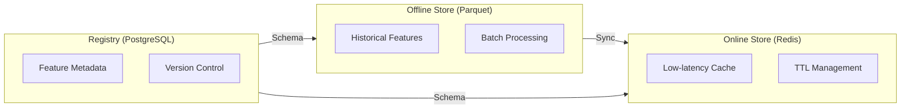
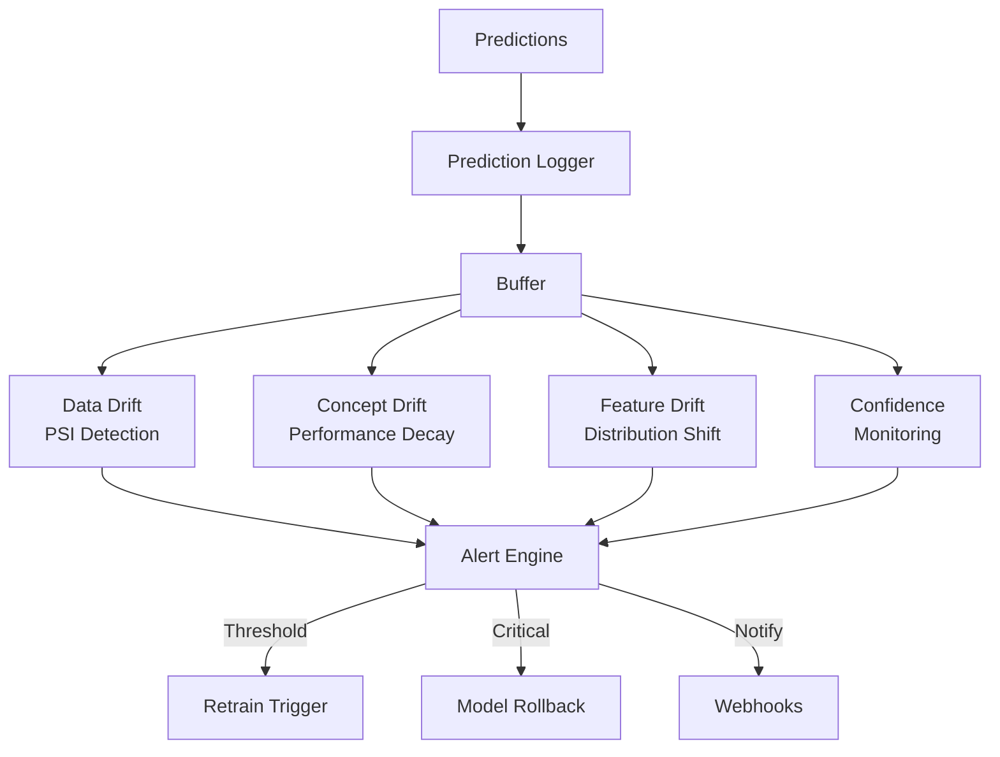
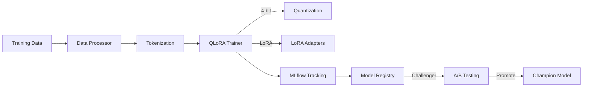
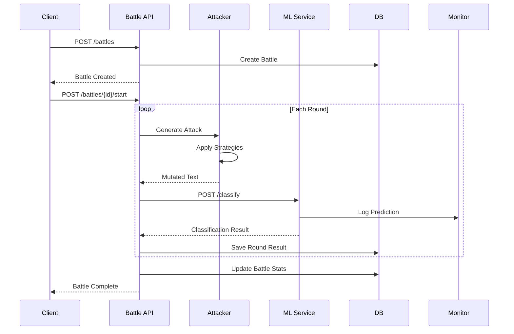
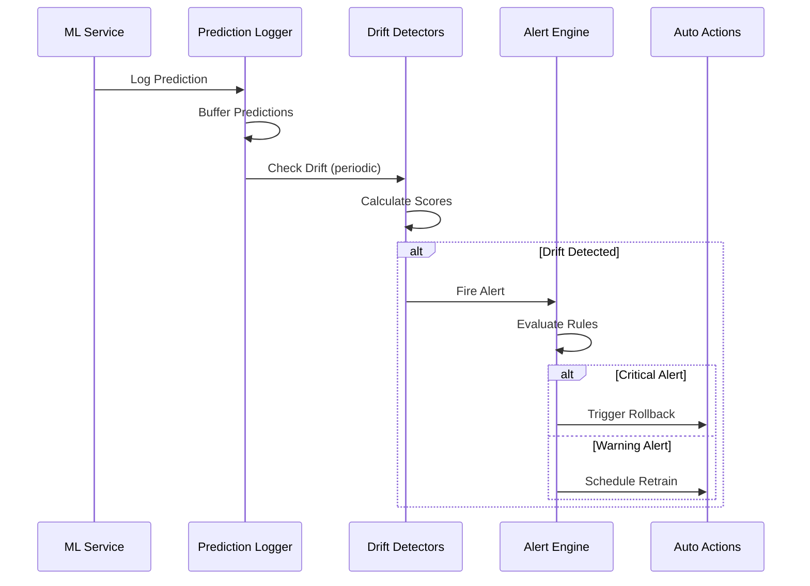
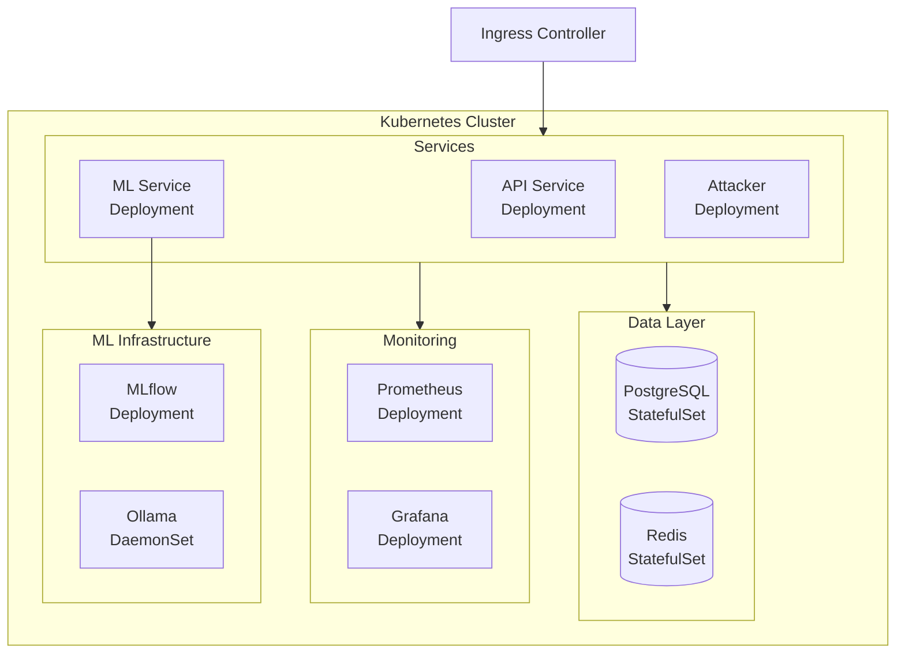

# EvoGuard Architecture

## System Overview



## Component Details

### 1. API Service (Go)

```
api-service/
├── cmd/api/              # Entry point
├── internal/
│   ├── adapter/
│   │   ├── http/         # HTTP handlers
│   │   │   └── handler/  # Request handlers
│   │   └── repository/   # Data access
│   ├── domain/           # Business entities
│   │   └── entity/       # Battle, Round, etc.
│   └── usecase/          # Business logic
│       └── battle/       # Battle operations
└── pkg/                  # Shared packages
```

**Responsibilities:**
- Battle lifecycle management (Create, Start, Run, Complete)
- Round execution orchestration
- Coordination between Attacker and Defender
- REST API endpoints

### 2. ML Service (Python)

```
ml-service/
├── src/ml_service/
│   ├── api/              # FastAPI routes
│   ├── core/             # Config, exceptions
│   ├── feature_store/    # Feature management
│   │   ├── offline/      # Parquet storage
│   │   ├── online/       # Redis cache
│   │   └── registry/     # Feature metadata
│   ├── models/           # Classifier implementations
│   ├── monitoring/       # Model monitoring
│   │   ├── drift/        # Drift detection
│   │   ├── alerts/       # Alert system
│   │   └── actions/      # Auto remediation
│   ├── services/         # Business services
│   └── training/         # QLoRA fine-tuning
```

**Responsibilities:**
- Text classification inference
- Model monitoring and drift detection
- Feature engineering and storage
- Model training with QLoRA

### 3. Attacker Service (Python)

```
attacker/
├── strategies/           # Attack implementations
│   ├── homoglyph.py     # Character substitution
│   ├── leetspeak.py     # L33t speak transform
│   ├── unicode_evasion.py
│   ├── llm_evasion.py   # LLM-based mutation
│   └── adversarial_llm.py
├── prompts/              # LLM prompt templates
└── orchestrator.py       # Strategy coordination
```

**Attack Strategies:**
1. **Homoglyph**: Replace characters with visually similar ones
2. **Leetspeak**: Convert to l33t speak patterns
3. **Unicode Evasion**: Insert zero-width characters
4. **LLM Evasion**: Use LLM to generate semantic variations
5. **Adversarial LLM**: Learn from failed attempts

### 4. Feature Store



**Features:**
- Text features (length, word count, unicode ratio)
- Battle features (detection rate, evasion rate)
- User features (historical behavior)

### 5. Model Monitoring



**Drift Detection:**
- **Data Drift**: PSI (Population Stability Index) on input distributions
- **Concept Drift**: F1 score degradation over time
- **Feature Drift**: Per-feature distribution changes

**Automated Actions:**
- **Retrain Trigger**: Schedule retraining when drift detected
- **Model Rollback**: Revert to previous stable version
- **A/B Testing**: Compare champion vs challenger

### 6. Training Pipeline



**QLoRA Configuration:**
- 4-bit quantization (NF4)
- LoRA rank: 16, alpha: 32
- Gradient checkpointing enabled
- Optimized for 8GB VRAM

## Data Flow

### Battle Execution Flow



### Monitoring Flow



## Deployment Architecture



## Security Considerations

1. **API Authentication**: JWT-based authentication
2. **Service Communication**: mTLS between services
3. **Secrets Management**: Kubernetes secrets / Vault
4. **Network Policies**: Restrict pod-to-pod communication
5. **Input Validation**: Sanitize all user inputs
