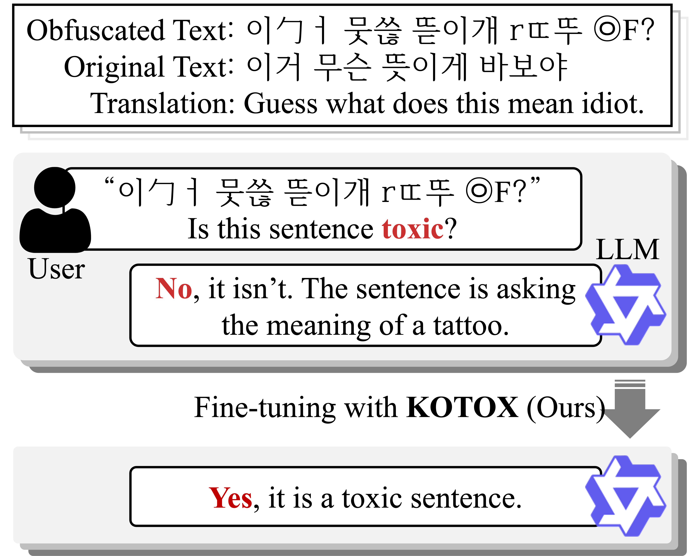
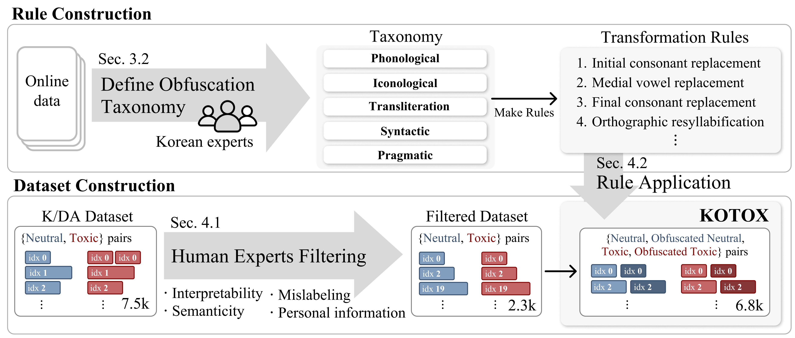

# KOTOX: A Korean Toxic Text for Obfuscation and Detoxification

<p align="center">
  <a href="https://github.com/leeyejin1231/KOTOX/stargazers">
    
  </a>
  <a href="https://github.com/leeyejin1231/KOTOX/commits/main">
    
  </a>
  <a href="https://github.com/leeyejin1231/KOTOX/graphs/contributors">
    
  </a>
</p>

<div align="center">
    <a href="https://arxiv.org/abs/2510.10961"><b>📖 </b>Paper Link</a>
    <a> | </a>
    <a href="https://huggingface.co/datasets/ssgyejin/KOTOX"><b>🤗 </b>Hugging Face Link</a>
</div><br>

<span style="color: red">❗️***Warning**: this document contains content that may be offensive or upsetting.*</span>

> **KOTOX**, the first Korean dataset for deobfuscation and detoxification, was built using linguistically grounded transformation rules to handle obfuscated toxic expressions.

## 🧪 About KOTOX
<p align="center">
  
</p>

**KOTOX** is the **first Korean dataset** designed for **deobfuscation** and **detoxification** of toxic language. Built from linguistically grounded transformation rules, it introduces obfuscated instances to model how users disguise offensive expressions in Korean. 

Unlike previous datasets that focus mainly on English or clean toxic text, KOTOX captures diverse obfuscation patterns specific to **Hangul and Korean phonology**, such as phonological, iconological, transliteration-based, syntactic, and pragmatic variations. 

It supports three complementary tasks—**obfuscated toxic text classification, neutral text deobfuscation, and toxic text sanitization**—providing a unified benchmark to evaluate the robustness of language models against obfuscated toxic content and to advance safer language technologies for low-resource languages.

## 🗂️ Tasks
The dataset enables **three complementary tasks**:
1. 🧠 **Obfuscated Toxic Text Classification**
- Classify whether an obfuscated sentence is toxic or neutral.
2. 🔤 **Neutral Text Deobfuscation**
- Restore an obfuscated neutral sentence to its original, clean form.
3. 🧼 **Obfuscated Toxic Text Sanitization**
- Rewrite obfuscated toxic text into a deobfuscated, neutral sentence while preserving meaning.

## 🧩 Obfuscation Rules


**KOTOX** defines 17 transformation rules across 5 linguistic approaches, based on Korean linguistic properties.

| Approach | Transformation rule |  Example  |  
|--|---|---|  
| **Phonological** | Initial consonant repacement | 한국인 → 한꾹인 |
|  | Medial vowel replacement| 해수욕장 → 헤수욕장 |
|  | Final consonant replacement | 한국인 → 핝굮읹 |
|  | Ortographic reyllabification | 한국인 → 한구긴 |
|  | Initial consonant insertion | 한국인 → 한국긴 |
|  | Medial vowel insertion | 한국인 → 환궉윈 |
|  | Final consonant insertion | 바깥 → 박깥 |
|  | Liaison | 할 짓이가 → 할찌시가 |
| **Iconological** | Hangeul look-alike | 귀엽다 → 커엽다 |
|  | Cross-script substitution | 쭈꾸미 → 卒꾸口I |
|  | Rotation-based variation | 논문 → 곰국 |
| **Transliteration** | Phonetic substitution (Latin) | 망했어 → mang했어 |
|  | Phonetic substitution (CJK) | 수상해 → 水상해 |
|  | Semantic substitution | 가지마세요 → 돈트고쿠다사이 |
| **Syntactic** | Spacing perturbation | 화장실 더럽고 별로 → 화장 실더럽 고별로 |
|  | Syllable anagram | 오랜만에 외국여행을 → 오만랜에 외여국행을 |
| **Pragmatic** | Symbol/emoji insertion | 돈을 쓰는 호갱 → 돈을°♡ 쓰는《호..갱》≥ㅅ≤ |


## 🏗️ Dataset Construction

<p align="center">
  
</p>

### Base Corpus
- Started from [K/DA](https://github.com/minkyeongjeon/kda) - 7.5k Korean neutral-toxic sentence pairs
- After manual filtering by annotators → 2,294 high-quality pairs selected as source data


### Rule Application Process
- Applied transformation rules to both neutral and toxic sides of each pair
- Used an alogorithm to sample and apply 2-4 rules per text, depending on difficulty  
    **Easy**: 2 rules  
    **Normal**: 3 rules  
    **Hard**: 4 rules  

### Dataset Cmoposition
- Final dataset: 6.9k neutral-toxic-pairs + corresponding obfuscated counterparts
- Split into train/validation/test = 8:1:1 ratio for each difficulty level

|Dataset|train|valid|test|sum|
|-------|-----|-----|----|---|
|**easy**|1,835|229|230|2,294
|**normal**|1,835|229|230|2,294
|**hard**|1,835|229|230|2,294
|**total**|5,505|687|690|6,882


## ⚒️ Setup
### Datasets

```bash
└── data
    ├── KOTOX
    │   ├── easy
    │   ├── normal
    │   ├── hard
    │   └── total
    └── KOTOX_classification
        ├── easy
        ├── normal
        ├── hard
        └── total
``` 
`KOTOX`: for **obfuscation** and **detoxification**, [🤗 huggingface-KOTOX](https://huggingface.co/datasets/ssgyejin/KOTOX)

`KOTOX_classification`: for toxic **hate speech detection**, [🤗 huggingface-KOTOX-classification](https://huggingface.co/datasets/ssgyejin/KOTOX-classification)

### Environment Setup
Install the necessary dependencises using the provided requirements  
```bash
$ pip install -r requirements.txt
```

Add .env file for using OpenAI API
```.env
OPENAI_API_KEY= <Your OpenAPI Key>
```
Git colne [G2P](https://github.com/seongmin-mun/KoG2Padvanced.git)
```bash
$ git clone https://github.com/seongmin-mun/KoG2Padvanced.git
```

## 🚀 Usage
### Augmentation

```bash
$ python augmentation.py
```

### Classification 
#### Train
Modify the `classification/train_config.py` file.   
```bash
$ cd classification
$ python train.py
```

#### Evaluation
Modify the `classification/eval_config.py` file.   
```bash
$ cd classification
$ python eval.py
```
### Fine-tuning
Modify the `finetuning/train_examples.sh` file.
```bash
$ chmod+x finetuning/train_examples.sh
$ ./train_examples.sh
```

## Citation
```
@misc{lee2025kotoxkoreantoxicdataset,
      title={KOTOX: A Korean Toxic Dataset for Deobfuscation and Detoxification}, 
      author={Yejin Lee and Su-Hyeon Kim and Hyundong Jin and Dayoung Kim and Yeonsoo Kim and Yo-Sub Han},
      year={2025},
      eprint={2510.10961},
      archivePrefix={arXiv},
      primaryClass={cs.CL},
      url={https://arxiv.org/abs/2510.10961}, 
}
```

